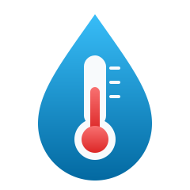
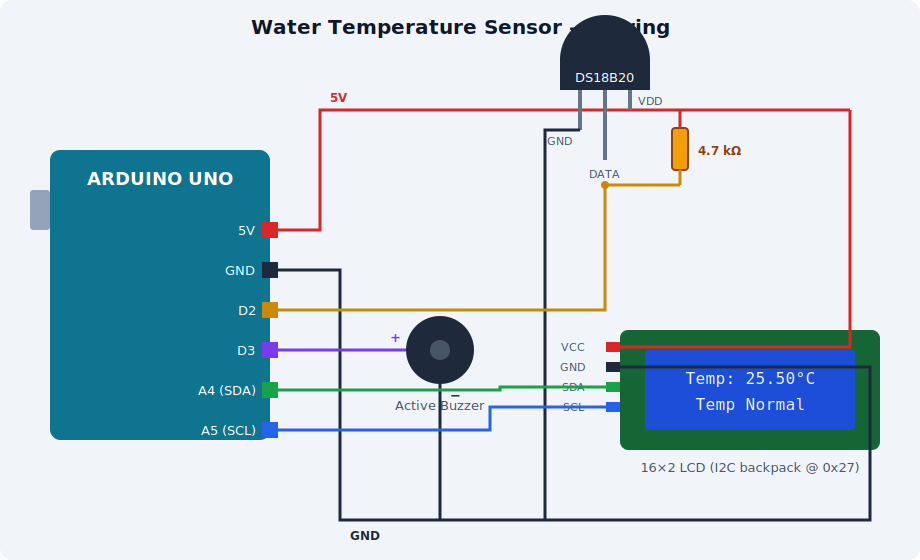
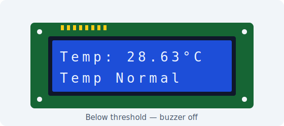
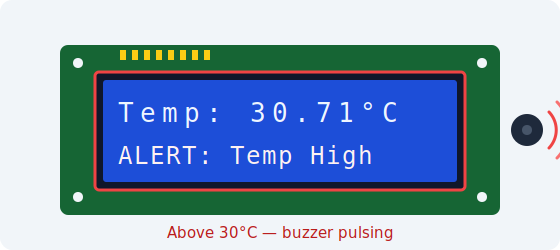

<div align="center">



# Water Temperature Sensor

**An Arduino DS18B20 water-temperature monitor with LCD display and high-temperature buzzer alarm**

[](https://www.arduino.cc/)
[](docs/Code.md)
[](docs/releases/v1.0.0.md)
[](https://github.com/SufiyanAasim/water-temperature-sensor/actions/workflows/build.yml)
[](LICENSE)
[]()
[](CONTRIBUTING.md)

Continuously reads water temperature from a waterproof DS18B20 probe, shows a live reading on a 16×2 I2C LCD, and pulses a buzzer whenever the water gets too hot — with hysteresis so the alarm doesn't chatter at the threshold.

[**Latest Release**](https://github.com/SufiyanAasim/water-temperature-sensor/releases) · [**Changelog**](CHANGELOG.md) · [**Roadmap**](ROADMAP.md) · [**Architecture**](docs/Architecture.md) · [**User Guide**](docs/guides/User-Guide.md) · [**Wiring**](docs/hardware/Wiring.md) · [**Report a Bug**](.github/ISSUE_TEMPLATE/bug.yml)

</div>

---

## 📸 System Overview

<div align="center">



| Normal | Alert |
|:---:|:---:|
|  |  |

</div>

---

## ✨ Features

### 🌡️ Live Temperature Readout
- DS18B20 digital probe read at full 12-bit resolution (0.0625 °C steps)
- Reading refreshed every second on a 16×2 I2C LCD with a proper `°` glyph
- Flicker-free display — rows are overwritten in place, never cleared

### 🚨 High-Temperature Alarm
- Buzzer pulses (beep-beep, not a solid tone) when temperature reaches **30 °C**
- **Hysteresis**: alarm arms at 30 °C but only disarms below 28 °C, so a reading hovering at the threshold can't rapidly toggle the buzzer
- LCD shows `ALERT: Temp High` / `Temp Normal` status on the second row

### 🛡️ Fault Handling
- Detects a disconnected/failed probe (`DEVICE_DISCONNECTED_C`) and shows `Sensor Error!` instead of a bogus `-127 °C` reading
- Reports "No sensor found!" at startup if the bus is empty
- Alarm is forced off during a sensor fault — no false alarms from bad reads
- **Buzzer self-test** — two chirps at boot verify the alarm hardware before it's ever needed

### ⚡ Non-Blocking Loop
- Asynchronous conversions (`setWaitForConversion(false)`) — the sketch never stalls waiting on the sensor
- All timing via `millis()`; no `delay()` anywhere in the loop

### 📤 Serial Logging
- CSV stream on the serial monitor (`millis,temp_c,status,session_min_c,session_max_c`) at 9600 baud — pipe it straight into a spreadsheet or plotter
- **Session min/max** tracked since power-up and included in every row — the last line of any capture holds the session's extremes

---

## 📦 Releases

| Version | Codename | Type | Date | Notes |
|---|---|---|---|---|
| **v1.0.0** | **Ion** | ✅ Stable release — **current** | 2026-07-18 | [Release notes](docs/releases/v1.0.0.md) |
| v0.0.1 | Atom | 🚧 Pre-release | 2026-07-15 | [Release notes](docs/releases/v0.0.1.md) |

Codenames follow a chemistry/particle theme. All releases: [GitHub Releases](https://github.com/SufiyanAasim/water-temperature-sensor/releases) · Process: [RELEASE.md](RELEASE.md) · History: [CHANGELOG.md](CHANGELOG.md)

---

## 🏗️ Architecture

```
DS18B20 probe ──OneWire (D2 + 4.7 kΩ)──►  ┌──────────────────────┐ ──I2C (A4/A5)──►  16×2 LCD
(in water)                                │     Arduino Uno      │                   (live readout)
                                          │                      │ ──D3───────────►  Active Buzzer
                                          │  non-blocking loop:  │                   (pulsed alarm)
                                          │  read → validate →   │
                                          │  display · log ·     │ ──USB serial───►  CSV telemetry
                                          │  alarm (hysteresis)  │                   (9600 baud)
                                          └──────────────────────┘
```

Design rationale, the alarm state machine, and the fault-handling model: [docs/Architecture.md](docs/Architecture.md)

---

## 🛠️ Technology Stack

| Layer | Technology |
|-------|-----------|
| Microcontroller | Arduino Uno / Nano (ATmega328P, 5 V, 16 MHz) |
| Language | C++ (Arduino sketch) |
| Sensor bus | OneWire — single data line, 4.7 kΩ pull-up |
| Temperature sensor | DS18B20 waterproof probe, 12-bit digital |
| Display | HD44780 16×2 LCD over I2C (PCF8574 backpack) |
| Alarm | Active buzzer, GPIO-driven with hysteresis state machine |
| Telemetry | USB serial CSV @ 9600 baud |
| Simulation | Tinkercad Circuits |
| CI | GitHub Actions — `arduino/compile-sketches` for Uno **and** Nano |

### Libraries

| Library | Purpose |
|---------|---------|
| [`OneWire`](https://github.com/PaulStoffregen/OneWire) | OneWire bus protocol for the DS18B20 |
| [`DallasTemperature`](https://github.com/milesburton/Arduino-Temperature-Control-Library) | DS18B20 conversions, resolution, async mode |
| [`LiquidCrystal I2C`](https://github.com/johnrickman/LiquidCrystal_I2C) | 16×2 LCD over the PCF8574 I2C backpack |

---

## 🧰 Hardware Required

| Component | Qty | Notes |
|---|---|---|
| Arduino Uno / Nano | 1 | Any AVR board with I2C works |
| DS18B20 temperature sensor | 1 | Waterproof probe version recommended |
| 16×2 LCD with I2C backpack | 1 | PCF8574, address `0x27` (some are `0x3F`) |
| Active buzzer | 1 | Driven directly from pin 3 |
| 4.7 kΩ resistor | 1 | Pull-up between DS18B20 data and 5 V — **required** |
| Breadboard + jumper wires | — | |

Full bill of materials with specifications, current budget, and library versions: [docs/hardware/Requirements.md](docs/hardware/Requirements.md)

## 🔌 Wiring

| DS18B20 | Arduino |
|---|---|
| VCC (red) | 5V |
| GND (black) | GND |
| DATA (yellow) | D2 (+ 4.7 kΩ pull-up to 5 V) |

| LCD (I2C) | Arduino |
|---|---|
| VCC | 5V |
| GND | GND |
| SDA | A4 |
| SCL | A5 |

| Buzzer | Arduino |
|---|---|
| + | D3 |
| − | GND |

Full details, breadboard build photos, and the Fritzing layout: [docs/hardware/Wiring.md](docs/hardware/Wiring.md)

---

## 🚀 Getting Started

1. **Install the Arduino IDE** — [arduino.cc/en/software](https://www.arduino.cc/en/software)
2. **Install the libraries** via *Sketch → Include Library → Manage Libraries…*:
   - `OneWire` (Paul Stoffregen)
   - `DallasTemperature` (Miles Burton)
   - `LiquidCrystal I2C` (Frank de Brabander / johnrickman)
3. **Wire the circuit** as above — don't forget the 4.7 kΩ pull-up
4. **Open** [`WaterTempratureSensor.ino`](WaterTempratureSensor/WaterTempratureSensor.ino), select your board and port, and **Upload**
5. Listen for the **two self-test chirps**, then open the **Serial Monitor** at 9600 baud to see the CSV log

Command-line build (`arduino-cli`): [docs/Development.md](docs/Development.md)

## ⚙️ Configuration

All tunables are `#define`s at the top of the sketch:

| Define | Default | Meaning |
|---|---|---|
| `ONE_WIRE_BUS` | `2` | DS18B20 data pin |
| `BUZZER_PIN` | `3` | Buzzer pin |
| `LCD_ADDRESS` | `0x27` | I2C address of the LCD (try `0x3F` if blank) |
| `ALARM_ON_C` | `30.0` | Alarm arms at/above this temperature |
| `ALARM_OFF_C` | `28.0` | Alarm disarms only below this (hysteresis) |
| `READ_INTERVAL_MS` | `1000` | Time between readings |
| `BEEP_PERIOD_MS` | `500` | Buzzer pulse period while alarming |
| `SENSOR_BITS` | `12` | DS18B20 resolution, 9–12 bits |

---

## 🗂️ Project Structure

```
water-temperature-sensor/
├── WaterTempratureSensor/
│   └── WaterTempratureSensor.ino   # The sketch — all logic lives here
├── archive/                    # Historical sketch versions (v0.0.1 "Atom", …)
├── assets/                     # Logo & artwork
├── docs/
│   ├── Architecture.md                 # Design rationale, block diagram, firmware architecture
│   ├── Code.md                         # Annotated source listing (reference copy)
│   ├── Development.md                  # Build, simulate, test, release process
│   ├── guides/User-Guide.md            # Operating the device
│   ├── hardware/Requirements.md        # Bill of materials, electrical & software specs
│   ├── hardware/Wiring.md              # Wiring, breadboard build photos & Fritzing layout
│   ├── troubleshooting/Troubleshooting.md
│   ├── images/                         # Photos, block diagram & vector figures
│   └── releases/                       # Per-version release notes
├── .github/                    # Issue templates & CI
├── CHANGELOG.md
├── CHECKSUMS.sha256            # Artifact integrity hashes
├── CONTRIBUTING.md
├── LICENSE
├── README.md
├── RELEASE.md                  # Release process
├── ROADMAP.md
└── SECURITY.md
```

---

## 🧪 Testing

There is no automated test suite — the sketch is a single hardware-bound loop, so every change is validated behaviourally on real hardware (CI compile-checks Uno **and** Nano, including the archived v0.0.1 sketch).

Manual validation checklist:
1. Power up — confirm **two self-test chirps**, then `Water Temp / Starting...`.
2. Normal path — reading updates every second with no display flicker; serial rows well-formed.
3. Alarm path — warm the probe past 30 °C: `ALERT: Temp High` + pulsed buzzer.
4. Hysteresis — cool to 29 °C and confirm the alarm **stays on**; it must release only below 28 °C.
5. Fault path — pull the DATA wire mid-run: `Sensor Error!`, `error` serial row, alarm forced off; reconnect and confirm recovery without a reset.

Full procedure: [docs/Development.md](docs/Development.md#testing-a-change)

---

## 🛡️ Security

Fully offline, single-purpose embedded device — no network interface, no stored personal data. The safety-relevant surface is the alarm path itself: sensor faults force the alarm off rather than sounding false alerts, hysteresis prevents threshold chatter, and the boot self-test catches dead alarm hardware. Release artifacts are integrity-hashed in [CHECKSUMS.sha256](CHECKSUMS.sha256). See [SECURITY.md](SECURITY.md) to report a safety-relevant issue.

---

## 🗺️ Roadmap

See [ROADMAP.md](ROADMAP.md) — planned: serial-configurable thresholds (EEPROM-persisted), Fahrenheit mode, mute button, DS18B20 multi-probe support, SD-card logging, and an ESP32 web-dashboard port.

---

## 🤝 Contributors

<table>
  <tr>
    <td align="center">
      <a href="https://github.com/SufiyanAasim">
        <br/>
        <sub><b>Sufiyan Aasim</b></sub>
      </a><br/>
      <sub>Author & Maintainer — Circuit Design · Firmware · Docs</sub>
    </td>
  </tr>
</table>

See [CONTRIBUTING.md](CONTRIBUTING.md) to get involved · Contact: **sufiyanaasim@outlook.com**

---

## 📄 License

[MIT License](LICENSE) © 2026 Sufiyan Aasim.

---

<div align="center">

⭐ **Star this repo if it kept your water at the right temperature.**

[Report Bug](.github/ISSUE_TEMPLATE/bug.yml) · [Request Feature](.github/ISSUE_TEMPLATE/feature.yml) · [Releases](https://github.com/SufiyanAasim/water-temperature-sensor/releases) · [Changelog](CHANGELOG.md)

</div>
