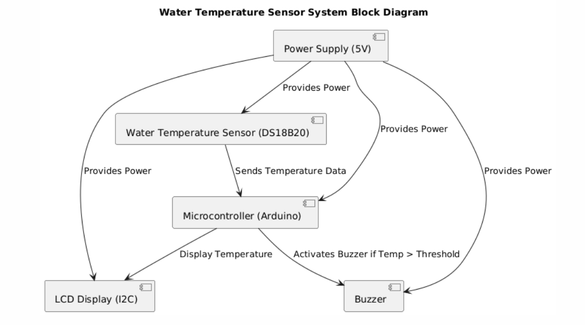

# Architecture

## Background & Motivation

Water temperature monitoring matters in aquariums, water treatment, and industrial processes — and manual monitoring is inefficient and error-prone: readings are infrequent, depend on someone being present, and give no immediate warning when conditions become unsafe. This project is a cost-effective device that measures water temperature continuously and raises an audible alert the moment a safety threshold is breached.

**Design goals:**

- Accurate real-time measurement (12-bit digital readings, 0.0625 °C steps)
- At-a-glance visibility (LCD) plus machine-readable telemetry (serial CSV)
- A safety alarm that can't false-trigger on sensor faults and can't chatter at the threshold
- Cheap, readily available components throughout

## Component Selection

| Choice | Why |
|---|---|
| **Arduino Uno** | Reliable, ubiquitous, extensive library support for sensor integration |
| **DS18B20** (vs. analog LM35 etc.) | Waterproof probe packaging; digital OneWire transmission is immune to analog noise over the probe cable — critical in liquid environments |
| **I2C LCD backpack** | Two-wire display interface (A4/A5) leaves pins free for future expansion |
| **Active buzzer** | Driven with a bare GPIO — no driver circuitry or `tone()` PWM needed |

## System Block Diagram



Signal flow: the DS18B20 measures temperature digitally on the probe itself and transmits it over the OneWire bus (D2, 4.7 kΩ pull-up). The Arduino validates each reading, updates the LCD (I2C), streams a CSV row over USB serial, and drives the buzzer (D3) when the alarm condition holds.

## Firmware Architecture

All logic lives in [`WaterTempratureSensor.ino`](../WaterTempratureSensor/WaterTempratureSensor.ino) — a single sketch, structured around three principles:

### 1. Non-blocking timing

There is no `delay()` in the loop. Conversions are requested asynchronously (`setWaitForConversion(false)`); the loop polls `millis()` and picks up the result only after the sensor's conversion time (~750 ms at 12 bits) has elapsed. This is what allows the buzzer to pulse on its own 500 ms schedule while a conversion is still in flight — and what keeps the design extensible.

```text
loop() every pass:
├── interval elapsed?        → start a new conversion (returns immediately)
├── conversion time elapsed? → read result → validate → display + log + alarm
└── alarm active?            → toggle buzzer on its own 500 ms cycle
```

### 2. Fault-safe readings

Every read is validated before use:

- `DEVICE_DISCONNECTED_C` (-127) → LCD shows `Sensor Error!`, serial logs an `error` row, and the alarm is **forced off** — bad data can never sound (or sustain) a false alarm
- Empty bus at startup → `No sensor found!`
- Boot self-test: the buzzer chirps twice at power-up, so dead alarm hardware is caught before it's ever needed

### 3. Hysteresis alarm state machine

```text
            reading ≥ 30 °C (ALARM_ON_C)
   ┌──────────┐ ─────────────────────────► ┌──────────┐
   │  NORMAL  │                            │  ALARM   │  buzzer pulses
   └──────────┘ ◄───────────────────────── └──────────┘  (500 ms cycle)
            reading < 28 °C (ALARM_OFF_C)
```

The 2 °C gap means water hovering exactly at the threshold can't rapidly toggle the buzzer. Both thresholds are `#define`s documented in the [README configuration table](../README.md#%EF%B8%8F-configuration).

### Display strategy

The 16×2 LCD is never cleared — both rows are overwritten in place and padded to the full 16 columns, so the display refreshes without flicker. A custom CGRAM glyph renders a proper `°` symbol.

### Telemetry

Every reading emits a CSV row over serial (9600 baud):

```text
millis,temp_c,status,session_min_c,session_max_c
```

Session min/max are tracked across all valid readings since power-up, so the last captured row always contains the session's extremes. Format details in the [User Guide](guides/User-Guide.md#serial-log).

## Verification

The design was verified in **Tinkercad** simulation before hardware assembly, then on a physical Arduino Uno breadboard build — see the build photos in the [Wiring Guide](hardware/Wiring.md#breadboard-build). CI compiles the sketch for Uno and Nano on every push ([workflow](../.github/workflows/build.yml)).

## Future Direction

The non-blocking core is deliberately extensible: multi-probe support, SD-card logging, serial-configurable thresholds, and an ESP32/web port are all planned — see the [Roadmap](../ROADMAP.md).
