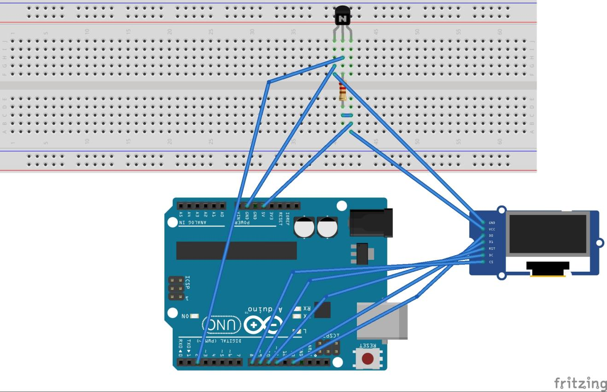
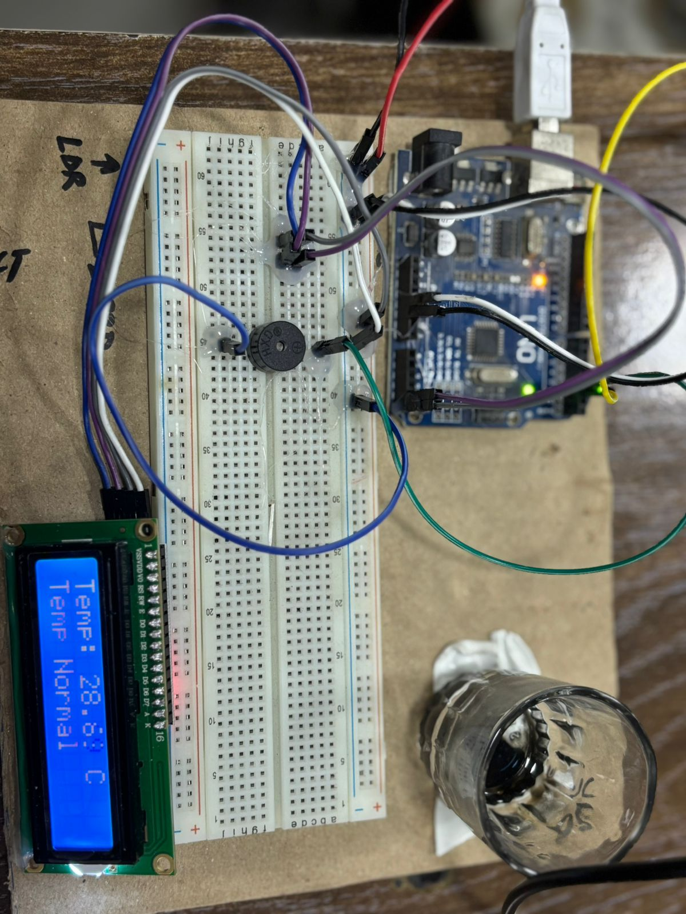
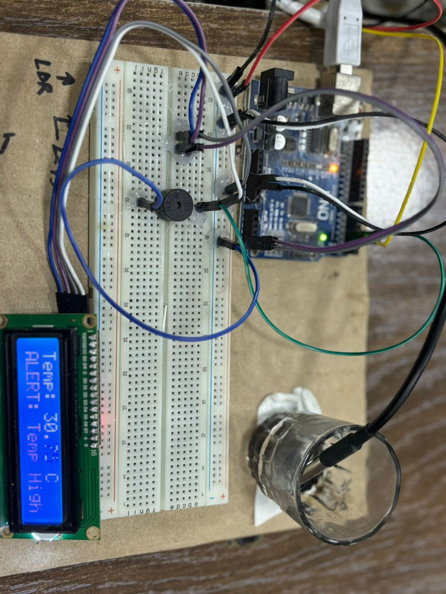

# Wiring Guide

## Parts

| Component | Qty | Notes |
|---|---|---|
| Arduino Uno / Nano | 1 | Any 5 V AVR board with I2C |
| DS18B20 | 1 | Waterproof probe version for actual water use |
| 16×2 LCD + I2C backpack | 1 | PCF8574 backpack, usually address `0x27` |
| Active buzzer | 1 | 5 V, driven directly from a GPIO |
| 4.7 kΩ resistor | 1 | OneWire bus pull-up — **not optional** |
| Breadboard + jumpers | — | |

## Connections

### DS18B20 (waterproof probe)

| Wire | Connect to |
|---|---|
| Red (VCC) | Arduino 5V |
| Black (GND) | Arduino GND |
| Yellow (DATA) | Arduino **D2** |

**Pull-up:** place the 4.7 kΩ resistor between DATA and 5 V. Without it the bus floats and you'll read `-127 °C` (shown as `Sensor Error!`).

> Powered (non-parasite) mode is assumed. Parasite power works with the same sketch but is less reliable on long probe cables.

### LCD (I2C backpack)

| LCD pin | Arduino (Uno/Nano) |
|---|---|
| VCC | 5V |
| GND | GND |
| SDA | **A4** |
| SCL | **A5** |

On boards with dedicated SDA/SCL pins (e.g. Uno R3 top-left), those work too — they're the same bus.

### Buzzer

| Buzzer | Arduino |
|---|---|
| + | **D3** |
| − | GND |

An *active* buzzer (built-in oscillator) is expected — the sketch just switches the pin HIGH/LOW. A passive buzzer will only click; swap `digitalWrite` for `tone()` if that's all you have.

## Breadboard Build

Reference layout (Fritzing — display module shown is representative):

The physical build in both states, probe submerged in a glass of water:

**Below 30 °C** — `Temp Normal`, buzzer silent:

**At/above 30 °C** — `ALERT: Temp High`, buzzer pulsing:

## Breadboard Tips

- Share one GND rail between all three peripherals and the Arduino.
- Keep the DS18B20 data wire short on a breadboard; for long probe runs (>3 m), stay with the 4.7 kΩ pull-up but consider dropping to 9–10-bit resolution.
- If the LCD shows solid blocks or nothing, adjust the contrast trimmer on the backpack, then check the address (see [Troubleshooting](../troubleshooting/Troubleshooting.md)).
